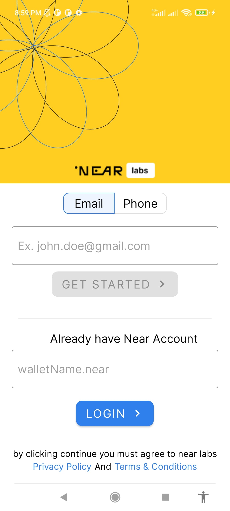
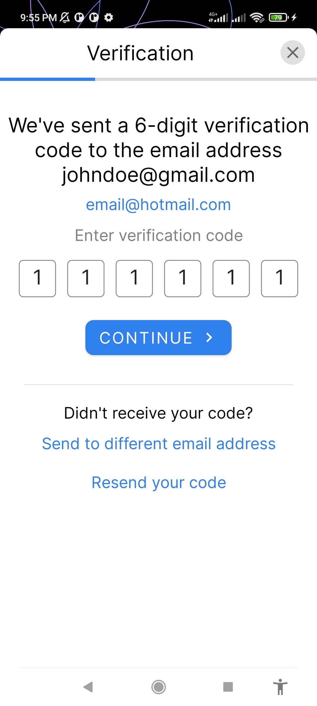
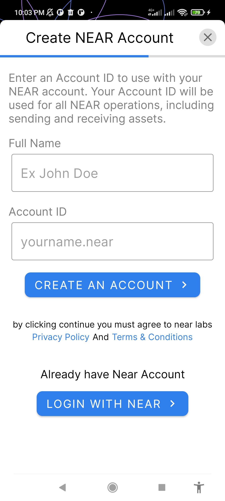
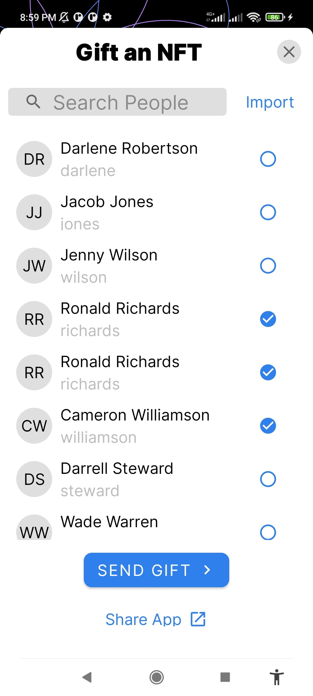
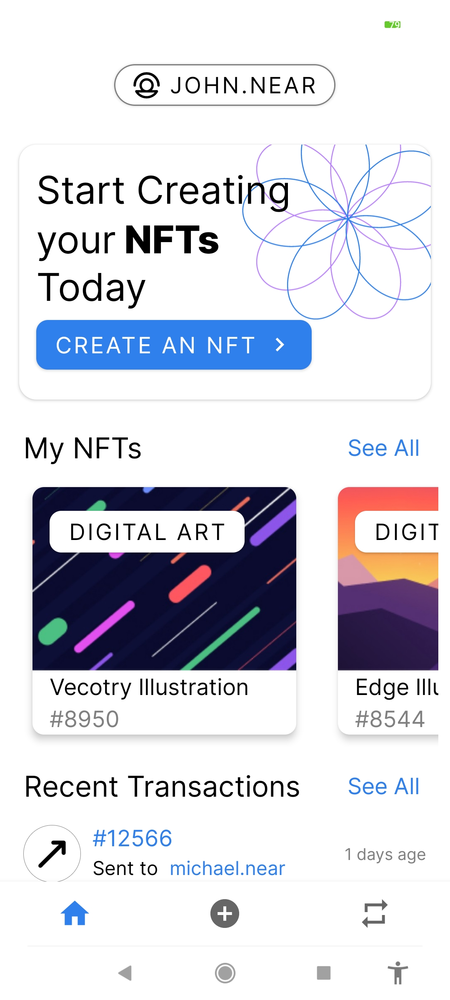
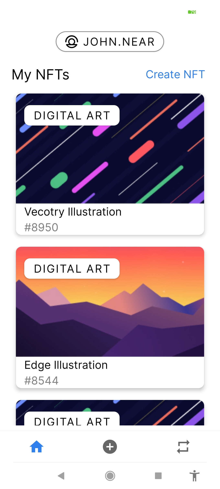
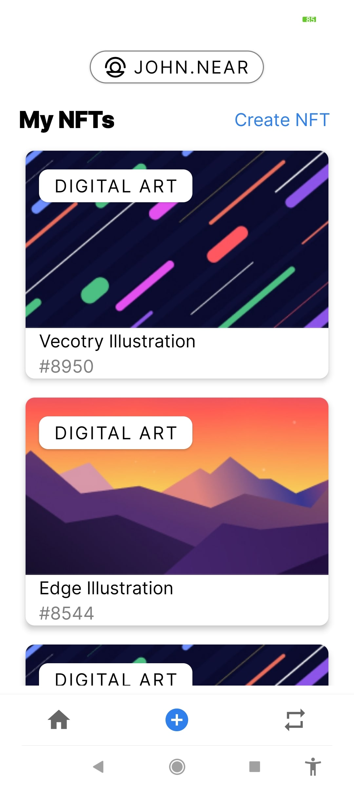
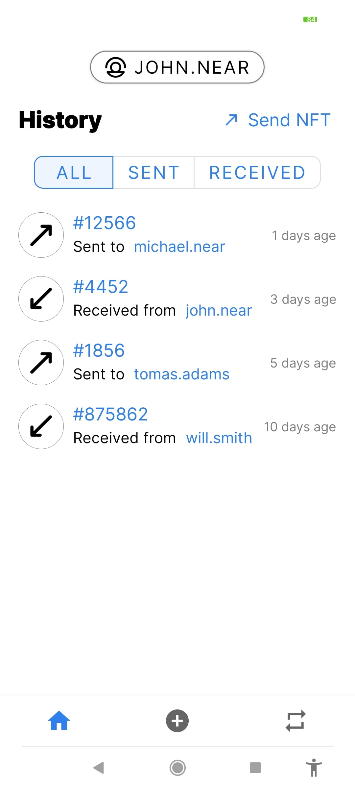
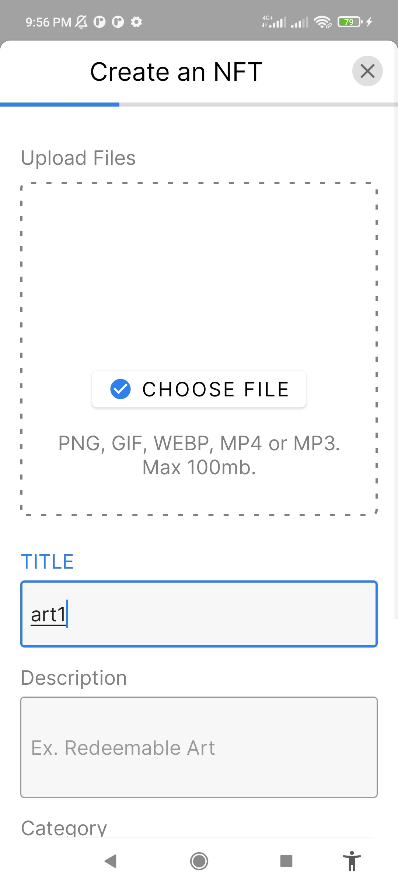
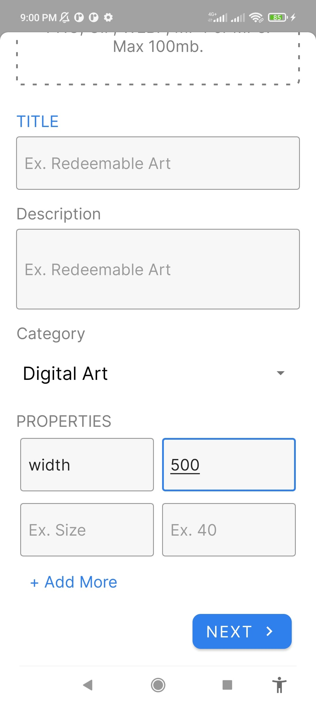

# NEAR NFT-Maker
##### Developer [@ma7moud3ly](https://github.com/ma7moud3ly)
##### Owner [@nearcomponents](https://github.com/nearcomponents)
##### Download [app-release.apk](https://github.com/Ma7moud3ly/near-nft-maker/blob/main/app/release/app-release.apk)
### Technologies 
- Kotlin
- Android Clean Architecture
- Live Data 
- Code/Data Binding
- Material Components
- Navigation Components

### Third Parties
- Glide
- Circle ImageView
- PinEditTextField

### Screenshots

 
  

  &nbsp;&nbsp;&nbsp;
  &nbsp;&nbsp;&nbsp;
  &nbsp;&nbsp;&nbsp;
  

 

  &nbsp;&nbsp;&nbsp;
  &nbsp;&nbsp;&nbsp;
  &nbsp;&nbsp;&nbsp;
  &nbsp;&nbsp;&nbsp;

  &nbsp;&nbsp;&nbsp;
  &nbsp;&nbsp;&nbsp;
  &nbsp;&nbsp;&nbsp;
  

 
 

